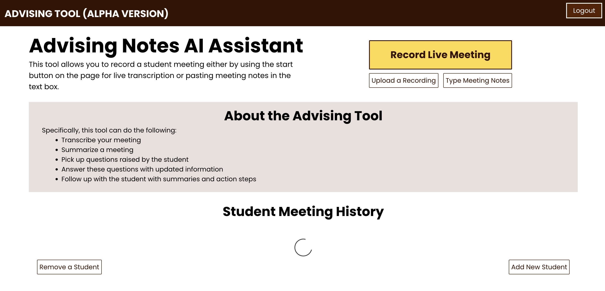

# LU360 Advising Tool (Full-Stack)

LU360 is a full-stack web application designed to help academic advisors record, manage, and summarize meetings with students. It features secure login via Auth0, student data management backed by an Azure SQL database, and interactive frontend tools built in React.

---

## Preview



---

## Overview

This platform enables:

- Recording or uploading advising meeting transcripts
- Associating summaries with students and academic programs
- Secure login using Auth0
- Automatic email summaries via MailerSend (WIP)
- Admin interface for adding/removing students
- Persistent storage using Azure SQL

---

## Installation Requirements

### System Dependencies

Ensure the following tools are installed on your machine:

- [Python 3.10+](https://www.python.org/downloads/)
  - make sure to install pip!
- [Node.js & npm (for React frontend)](https://nodejs.org/en)
- [Microsoft ODBC Driver 18 for SQL Server](https://learn.microsoft.com/en-us/sql/connect/odbc/download-odbc-driver-for-sql-server)
  - may need to install [homebrew](https://brew.sh/) if using macOS/linux
- [Docker (if using containerized deployment)](https://docs.docker.com/get-started/get-docker/)

### Backend: Python Packages

Install backend Python dependencies:

```bash
pip install -r requirements.txt
```

#### Key Libraries:

- Flask, Flask-RESTful, Flask-CORS, Flask-Session
- Authlib
- PyODBC
- python-dotenv
- fuzzywuzzy
- BeautifulSoup4
- memory-profiler
- SpeechRecognition (optional)
- smtplib (built-in)

### Frontend: Node Packages

Navigate to the `frontend` directory and run:

```bash
npm install
```

---

## Environment Configuration

Create a `.env` file in the backend root:

```env
AZURE_CONNECTION_STRING=your_azure_sql_connection_string
APP_SECRET_KEY=your_flask_secret_key
AUTH0_CLIENT_ID=your_auth0_client_id
AUTH0_CLIENT_SECRET=your_auth0_client_secret
AUTH0_DOMAIN=your_auth0_domain
FRONTEND_URL=http://localhost:3000
MAILERSEND_API_TOKEN=your_mailersend_token
MAILERSEND_SENDER=your_verified_mailersend_email
```

Create a `.env` file in the React frontend root:

```env
REACT_APP_BACKEND_URL=http://localhost:8000
REACT_APP_FRONTEND_URL=http://localhost:3000
```

---

## Running the App

### Local (Dev Mode)

Start the backend:

```bash
python3 app.py
```

Start the frontend:

```bash
cd frontend
npm start
```

### With Docker (Backend Only)

```bash
docker build -t lu360-app .
docker run --env-file .env -p 127.0.0.1:8000:8000 lu360-app
```

---

## Project Structure

### Backend

```
backend/
├── app.py              # Main Flask app entry point
├── logic.py            # Transcript processing, MailerSend logic
├── json_admin.py       # DB logic using Azure SQL
├── requirements.txt    # Backend dependencies
├── static/             # React build assets (if served from Flask)
└── templates/          # HTML templates for rendering
```

### Frontend (React)

```
frontend/
├── src/
│   ├── components/     # Reusable UI components
│   ├── App.js          # Route setup and auth state
│   ├── index.js        # React entry point
│   └── App.css         # Global styles
├── public/
└── .env                # Frontend environment vars
```

---

## Features

- Auth0 OAuth 2.0 login
- Student record CRUD operations
- Transcript uploads (or live dictation)
- Email summary delivery (MailerSend integration)
- Azure SQL database connection
- Interactive frontend with feedback and error handling
- Role-specific pages: Add, Remove, and View student meetings

---

## Entity Relationship Diagram (ERD)

```text
+------------------+            +-------------------+          +------------------------+
|     users        |            |     students      |          |       programs         |
+------------------+            +-------------------+          +------------------------+
| auth_id (PK)     |◄────────┐  | student_id (PK)   |          | id (PK)                |
| name             |         └──┤ counselor_id (FK) |──────────┤ auth_id (FK -> users)  |
| email            |            | name              |          | program_name           |
+------------------+            | major             |          | program_description    |
                                | year              |          | date                   |
                                | email (UNIQUE)    |          +------------------------+
                                +-------------------+

                                          ▲
                                          │
                                          │
                                          ▼

+--------------------+         +------------------------+
|     recordings     |         |    questions_answers   |
+--------------------+         +------------------------+
| id (PK)            |         | id (PK)                |
| student_id (FK)    |◄──────┐ | student_id (FK)        |
| student_email      |       └─┤ student_email          |
| timestamp          |         | questions (JSON)       |
| program            |         | answers (JSON)         |
| summary            |         | counselor_id (FK)      |
| transcript         |         +------------------------+
| counselor_id (FK)  |
+--------------------+

Legend:
- PK = Primary Key
- FK = Foreign Key
- JSON = Stored as JSON string in SQL
```

---

## UML Class Diagram

```text
+-----------------------------+
|           app.py           |
+-----------------------------+
| +home()                    |
| +login(), logout(),        |
| +callback()                |
| +record_meeting()          |
| +upload_recording()        |
| +delete_recording(id)      |
| +add_student()             |
| +remove_student()          |
| +get_students()            |
| +send_email()              |
| +program_info_handler()    |
| +find_answer_handler()     |
| +fetch_data(email)         |
| +transcript()              |
+-------------▲---------------+
              │ uses
              │
  ┌────────────┴────────────┐
  │                         │
  ▼                         ▼
+---------------------+   +-----------------------------+
|       Admin         |   |           Logic             |
+---------------------+   +-----------------------------+
| - conn_str: str     |   | - conn_str: str             |
+---------------------+   | - mailersend_token: str     |
| +connect()          |   | - mailersend_sender: str    |
| +setup_table()      |   +-----------------------------+
| +get_students()     |   | +connect()                  |
| +add_student(...)   |   | +transcribe_audio(path)     |
| +delete_recording() |   | +process_transcript(...)    |
| +get_student(...)   |   | +send_email(...)            |
| +add_recording(...) |   | +find_program_info(...)     |
| +export()           |   | +get_programs(...)          |
+---------------------+   | +find_answer(...)           |
                          +-----------------------------+
           ▲                           ▲
           │                           │
 connects  │                           │ interacts with
           ▼                           ▼
+----------------------+   +------------------------------+
|   Azure SQL DB       |   | MailerSend API / GPT-4       |
+----------------------+   +------------------------------+

Legend:
- app.py is the Flask controller and routing layer
- Admin handles all database operations (CRUD for students, programs, recordings)
- Logic handles transcript parsing and email composition/sending
```

---

## Contributors

- Thaksheel Alleck
- Selase Dzathor
- Dylan McClellan
